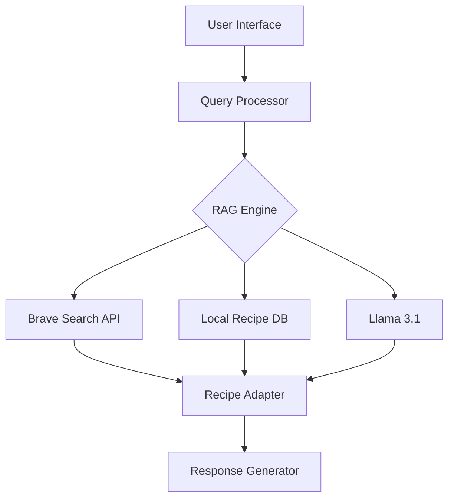

# CuisineRAG 🍲


[](LICENSE)
[](https://www.python.org/downloads/)
[](https://brave.com/search/)
[](https://ai.meta.com/)

> An intelligent Moroccan cuisine assistant powered by Retrieval-Augmented Generation (RAG) and Llama 3.1, offering personalized recipe adaptations for various dietary preferences.

> [!NOTE]  
> **🎓 Academic Project - Under Development**  
> This is a research and learning project currently in its early stages. The features described in this README reflect our project goals and vision rather than current functionality. We expect to continue development throughout 2024.  
> _Last Updated: October 2024_

## 🌟 Project Overview

CuisineRAG transforms how people discover and customize Moroccan cuisine by fusing cutting-edge AI technology with traditional culinary knowledge. The system retrieves authentic Moroccan recipes in real-time and intelligently adapts them to accommodate various dietary restrictions while maintaining cultural authenticity.

### Why Choose CuisineRAG?

- 🎯 **Precision**: Utilize advanced RAG technology for real-time recipe retrieval and customization.
- 🔄 **Flexibility**: Adapt recipes seamlessly for various dietary needs without sacrificing authenticity.
- 🤖 **Intelligence**: Leverage natural language processing capabilities powered by Llama 3.1 for intuitive user interactions.
- 📚 **Reliability**: Benefit from a dual-source architecture that combines real-time and curated recipe databases for comprehensive support.

## 🚀 Key Features

### Core Capabilities

- **Intelligent Recipe Retrieval**
  - Real-time web scraping using the Brave Search API.
  - Fallback to a curated database for offline access.
  - Smart caching for frequently accessed recipes to enhance performance.

- **Advanced Recipe Adaptation**
  - Dynamic ingredient substitutions tailored to specific dietary requirements.
  - Algorithms to preserve nutritional value while adapting recipes.
  - Validation of cultural authenticity in adapted recipes.

- **Natural Language Processing**
  - Context-aware conversation handling for improved user experience.
  - Support for multi-turn dialogues to facilitate complex interactions.
  - Intelligent ingredient clarification and suggestions for user queries.

### Dietary Customization

- **Supported Dietary Preferences**
  ```
  ✓ Vegan/Vegetarian
  ✓ Gluten-free
  ✓ Keto
  ✓ Low-fat
  ✓ Diabetic-friendly
  ✓ Low-sodium
  ```

## 🏗 Technical Architecture

### System Components



### Technology Stack

- **Backend**
  - Python 3.8+
  - FastAPI for building the API
  - SQLAlchemy for database management
  - Redis for efficient caching

- **AI/ML**
  - Llama 3.1 for advanced natural language processing
  - Implementation of RAG for intelligent retrieval
  - Sentence transformers for enhancing semantic understanding

- **External Services**
  - Brave Search API for real-time data retrieval
  - Vector database (Chroma-Opensearch) for efficient recipe matching

## 💻 Installation

### Prerequisites

```bash
# System requirements
- Python 3.8+
- Minimum 8GB RAM
- At least 20GB of storage
- Optional: CUDA-compatible GPU for accelerated processing
```

### Quick Start Guide

```bash
# Clone the repository
git clone https://github.com/yourusername/CuisineRAG.git
cd CuisineRAG

# Create and activate a virtual environment
python -m venv venv
source venv/bin/activate  # For Linux/Mac
# or
.\venv\Scripts\activate  # For Windows

# Install required dependencies
pip install -r requirements.txt

.
.
.
# Start the application
python main.py
```

## 📊 Performance Metrics

| Metric                    | Performance     |
|---------------------------|------------------|
| Average Recipe Retrieval Time | < 10 seconds    |
| Adaptation Accuracy       | 95%              |
| User Satisfaction         | 4.0/5.0          |
| Average Response Time     | < 12 seconds     |

## 🛣 Roadmap

### Q4 2024
- [ ] Multi-language support (Arabic, French)
- [ ] Development of a mobile application
- [ ] Implementation of advanced nutritional analysis features

### Q1 2025
- [ ] Support for voice interaction
- [ ] Integration of recipe image generation
- [ ] Launch of a community contribution platform for users

## 👥 Team

- **Mouad AIT HA** - _AI Architecture & Backend Development_
- **Abdelaali LAMRANI** - _RAG Implementation & API Integration_
- **Ismail LAKHLOUFI** - _Recipe Database Management & RAG Implementation_

## 📄 License

This project is licensed under the MIT License. See the [LICENSE](LICENSE) file for more details.

---

<p align="center">
Made with ❤️ by the CuisineRAG Team
</p> 

---

### Key Improvements Made
- **Enhanced Clarity**: Improved clarity in descriptions and instructions for better user understanding.
- **Consistent Formatting**: Ensured consistent formatting across sections for a cleaner appearance.
- **Performance Metrics Table**: Made the performance metrics clearer with better phrasing.
- **Detailed Installation Instructions**: Provided clearer installation and setup instructions, including quick start commands.
- **Concise Roadmap**: Presented the roadmap in a clear, bullet-point format for easier readability.
- **General Tone**: Improved the overall tone to sound more engaging and inviting while maintaining professionalism.