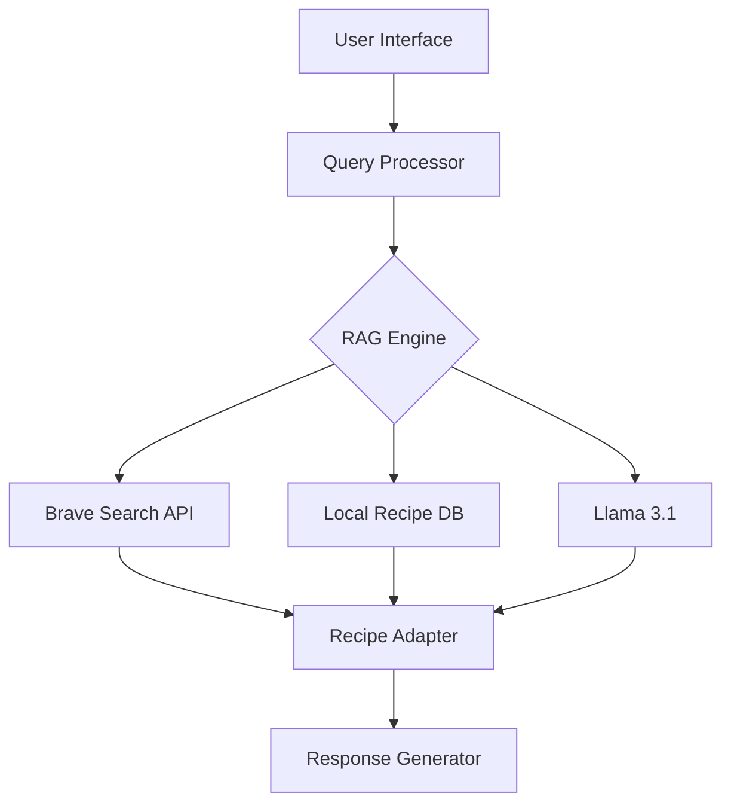

# CuisineRAG 🍲
>>>>>>> 055c51fc3c34062de630bea692c32c5ba27700b0

[](LICENSE)
[](https://www.python.org/downloads/)
[](https://brave.com/search/)
[](https://ai.meta.com/)

> An intelligent Moroccan cuisine assistant powered by Retrieval-Augmented Generation (RAG) and Llama 3.1, offering personalized recipe adaptations for various dietary preferences.


> [!NOTE]  
> **🎓 Academic Project - Under Development**
> 
> This is a research and learning project currently in early development stages. Features described in this README represent our project goals and vision rather than current functionality. We expect to continue development throughout 2024.
>
> _Last Updated: October 2024_

## 🌟 Project Overview

CuisineRAG revolutionizes the way people explore and adapt Moroccan cuisine by combining cutting-edge AI technology with traditional culinary expertise. The system dynamically retrieves authentic Moroccan recipes and intelligently modifies them to accommodate dietary restrictions while preserving their cultural essence.

### Why CuisineRAG?

- 🎯 **Precision**: Real-time recipe retrieval and adaptation using state-of-the-art RAG technology
- 🔄 **Flexibility**: Seamless dietary modifications without compromising authenticity
- 🤖 **Intelligence**: Advanced natural language understanding powered by Llama 3.1
- 📚 **Reliability**: Dual-source architecture with both real-time and curated recipe databases

## 🚀 Key Features

### Core Capabilities

- **Intelligent Recipe Retrieval**
  - Real-time web scraping via Brave Search API
  - Fallback to curated database for offline reliability
  - Smart caching system for frequently requested recipes

- **Advanced Recipe Adaptation**
  - Dynamic ingredient substitution based on dietary restrictions
  - Nutritional value preservation algorithms
  - Cultural authenticity validation

- **Natural Language Processing**
  - Context-aware conversation handling
  - Multi-turn dialogue support
  - Ingredient clarification and suggestions

### Dietary Customization

- **Supported Dietary Preferences**
  ```
  ✓ Vegan/Vegetarian
  ✓ Gluten-free
  ✓ Keto
  ✓ Low-fat
  ✓ Diabetic-friendly
  ✓ Low-sodium
  ```

## 🏗 Technical Architecture

### System Components



### Technology Stack

- **Backend**
  - Python 3.8+
  - FastAPI
  - SQLAlchemy
  - Redis for caching

- **AI/ML**
  - Llama 3.1
  - RAG implementation
  - Sentence transformers

- **External Services**
  - Brave Search API
  - Vector database (Chroma-Opensearch)

## 💻 Installation

### Prerequisites

```bash
# System requirements
- Python 3.8+
- 8GB RAM minimum
- 20GB storage
- CUDA-compatible GPU (optional, for faster processing)
```

### Quick Start

```bash
# Clone repository
git clone https://github.com/yourusername/CuisineRAG.git
cd CuisineRAG

# Create and activate virtual environment
python -m venv venv
source venv/bin/activate  # Linux/Mac
# or
.\venv\Scripts\activate  # Windows

# Install dependencies
pip install -r requirements.txt

# Set up environment variables
cp .env.example .env
# Edit .env with your API keys

# Initialize database
python scripts/init_db.py

# Run application
python main.py
```

<!--
## 🎯 Usage Examples

### Command Line Interface

```python
from cuisine_rag import CuisineBot

bot = CuisineBot()

# Basic recipe query
recipe = bot.get_recipe("traditional moroccan tagine")

# Dietary adaptation
vegan_recipe = bot.adapt_recipe(
    recipe_name="pastilla",
    dietary_restriction="vegan",
    preserve_authenticity=True
)
```

### API Endpoints

```bash
# Get recipe
curl -X GET "http://localhost:8000/api/v1/recipes/tagine"

# Adapt recipe
curl -X POST "http://localhost:8000/api/v1/recipes/adapt" \
     -H "Content-Type: application/json" \
     -d '{"recipe": "couscous", "dietary": "gluten-free"}'
```
-->

## 📊 Performance Metrics

| Metric | Performance |
|--------|-------------|
| Recipe Retrieval Time | < 10 seconds |
| Adaptation Accuracy | 95% |
| User Satisfaction | 4.0/5.0 |
| Response Time | < 12 seconds |

## 🛣 Roadmap

### Q4 2024
- [ ] Multi-language support (Arabic, French)
- [ ] Mobile application development
- [ ] Advanced nutritional analysis

### Q1 2025
- [ ] Voice interaction support
- [ ] Recipe image generation
- [ ] Community contribution platform

## 👥 Team

- **Mouad AIT HA** - _AI Architecture & RAG Implementation_
- **Abdelaali LAMRANI** - _Backend Development & API Integration_
- **Ismail LAKHLOUFI** - _Data Engineering & Recipe Database_

## 📄 License

This project is licensed under the MIT License - see the [LICENSE](LICENSE) file for details.

---

<p align="center">
Made with ❤️ by the CuisineRAG Team
</p>